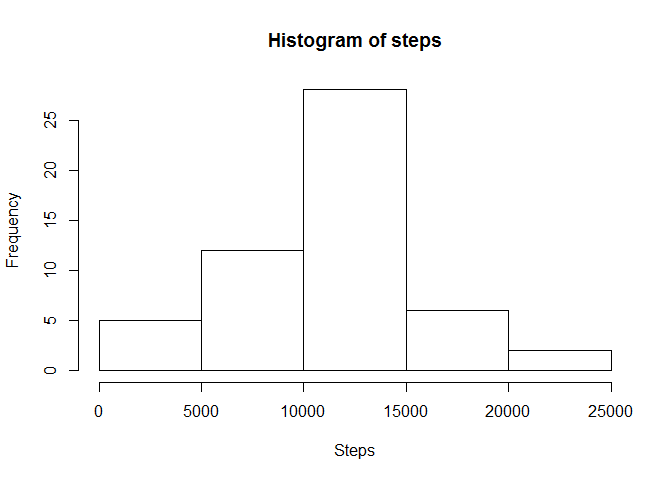
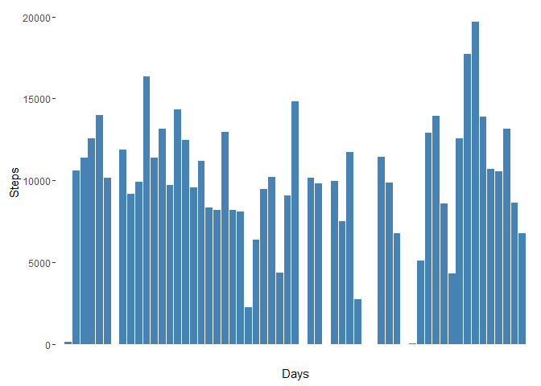
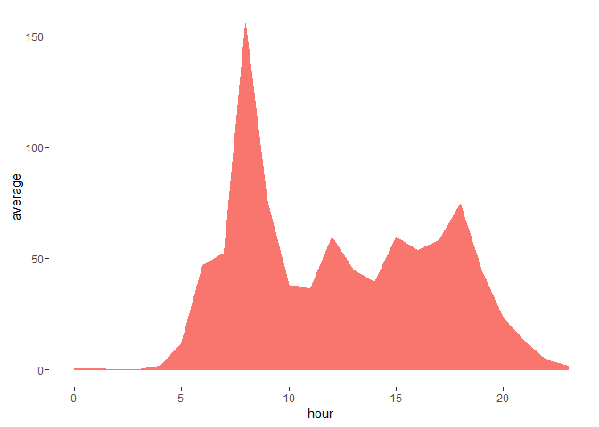
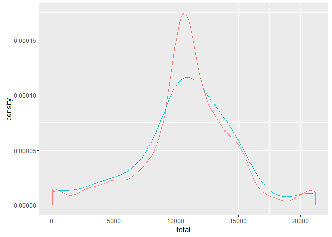
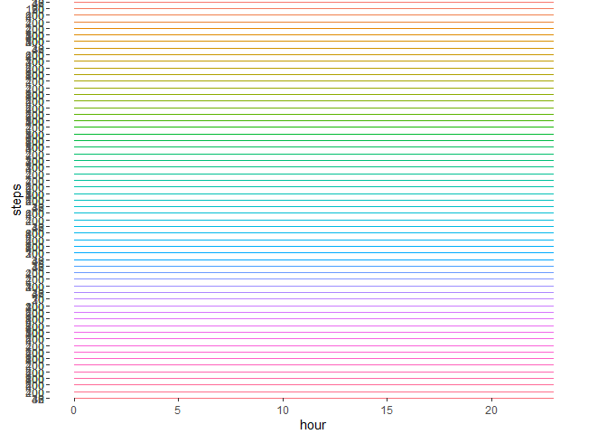
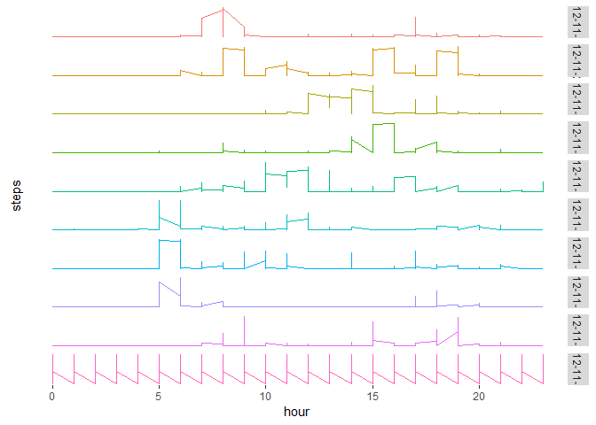
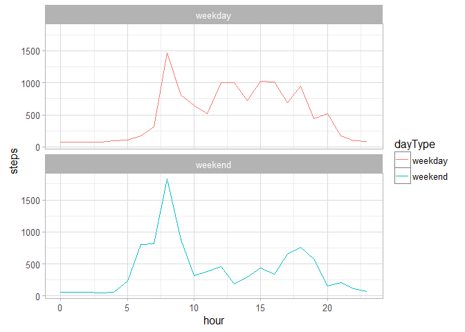

# Reproducible Research: Peer Assessment 1


## Loading and preprocessing the data

First at all loads the required libraries


```r
library(dplyr, warn.conflicts=F, quietly=T)
library(tidyr, warn.conflicts=F, quietly=T)
library(ggplot2, warn.conflicts=F, quietly=T)
```

Data is stored into data subdirectory.
Usually, the first step should be take a look into raw data from command line: In example with more command. But in this case wew know is a csv file

We try to read the file as csv, then we take a look to data frame with head (beginning of file) and tail (end of file) and structure


```r
df <- read.csv("./data/activity.csv")
head(df, n = 5)
```

```
##   steps       date interval
## 1    NA 2012-10-01        0
## 2    NA 2012-10-01        5
## 3    NA 2012-10-01       10
## 4    NA 2012-10-01       15
## 5    NA 2012-10-01       20
```

```r
tail(df, n = 5)
```

```
##       steps       date interval
## 17564    NA 2012-11-30     2335
## 17565    NA 2012-11-30     2340
## 17566    NA 2012-11-30     2345
## 17567    NA 2012-11-30     2350
## 17568    NA 2012-11-30     2355
```

```r
summary(df)
```

```
##      steps                date          interval     
##  Min.   :  0.00   2012-10-01:  288   Min.   :   0.0  
##  1st Qu.:  0.00   2012-10-02:  288   1st Qu.: 588.8  
##  Median :  0.00   2012-10-03:  288   Median :1177.5  
##  Mean   : 37.38   2012-10-04:  288   Mean   :1177.5  
##  3rd Qu.: 12.00   2012-10-05:  288   3rd Qu.:1766.2  
##  Max.   :806.00   2012-10-06:  288   Max.   :2355.0  
##  NA's   :2304     (Other)   :15840
```

### Data information

According the info provided: "*This device collects data at 5 minute intervals through out the day*" and taking a look of data we see these characteristics:

1. There are a lot of NAs
3. Date is a factor not a date type, could be useful for graphs but not for filtering
3. **Interval doesn't looks like significative**, show below:


```
## [1] "Records from 10 to 15"
```

```
##    steps       date interval
## 10    NA 2012-10-01       45
## 11    NA 2012-10-01       50
## 12    NA 2012-10-01       55
## 13    NA 2012-10-01      100
## 14    NA 2012-10-01      105
## 15    NA 2012-10-01      110
```

```
## [1] "Last and first records"
```

```
##     steps       date interval
## 288    NA 2012-10-01     2355
## 289     0 2012-10-02        0
```

There is a gap between records 12 and 13 and interval is reset when day starts.So we start modifying the data frame adding and index and setting hour and minute:


```r
df2 <- df
df2$interval <- seq.int(from=0, to=nrow(df) - 1)
df2$hour <- trunc(df2$interval / 12) %% 24
df2$minute <- ((df2$interval %% 288) %% 12) * 5
```
and now Data frame looks like:

```r
df2[287:290,]
```

```
##     steps       date interval hour minute
## 287    NA 2012-10-01      286   23     50
## 288    NA 2012-10-01      287   23     55
## 289     0 2012-10-02      288    0      0
## 290     0 2012-10-02      289    0      5
```


## What is mean total number of steps taken per day?

To answer this question as well as to show the frequency of total number of steps, we can summarize data by days:


```r
dft <- df2 %>% na.omit() %>% group_by(date) %>% summarise(total = sum(steps))
hist(dft$total, breaks=5, main="Histogram of steps", xlab="Steps")
```

<!-- -->

Other view can be total number of steps by day


```r
ggplot(df2, aes(x=date, y=steps)) + 
       geom_bar(stat='sum', na.rm=TRUE, fill="steelblue") +
       labs(x="Days", y="Steps") + 
       theme(legend.position="none", 
             panel.background=element_blank(), 
             axis.text.x=element_blank(),
             axis.ticks.x=element_blank())
```

<!-- -->

From totalized data frame we get:


**Mean: 1.0766189\times 10^{4}**

**Median: 10765**

## What is the average daily activity pattern?

Now we can group data by hour and see the activity daily pattern


```r
df3 <- df2 %>% na.omit() %>% group_by(hour) %>% summarise(average=mean(steps))

ggplot(df3, aes(x=hour, y=average, color="darkblue", fill="darkblue")) + 
       geom_area() +
       theme(legend.position="none", 
             panel.background=element_blank()) 
```

<!-- -->


## Imputing missing values

This approach consider the time interval. That is, some days at 13:00 user step 100 steps, so I assume that, when data at 13:00 is missing, probably user steped 100 steps

First step is get the average rounded along each minute:


```r
dfm <- df2 %>% na.omit() %>% group_by(minute) %>% 
                            summarise(average = round(mean(steps))) %>% 
                            spread(minute, average)
head(dfm)
```

```
## # A tibble: 1 × 12
##     `0`   `5`  `10`  `15`  `20`  `25`  `30`  `35`  `40`  `45`  `50`  `55`
##   <dbl> <dbl> <dbl> <dbl> <dbl> <dbl> <dbl> <dbl> <dbl> <dbl> <dbl> <dbl>
## 1    35    36    39    42    38    37    37    35    35    37    38    38
```


Then update NA values with their average (we create another data frame for commodity, and other one grouped by hours


```r
df3 <- df2
df3$steps <- ifelse(is.na(df3$steps), dfm[,as.character(df3$minute)], df3$steps)
df3$steps <- as.numeric(df3$steps)
head(df3)
```

```
##   steps       date interval hour minute
## 1    35 2012-10-01        0    0      0
## 2    36 2012-10-01        1    0      5
## 3    39 2012-10-01        2    0     10
## 4    42 2012-10-01        3    0     15
## 5    38 2012-10-01        4    0     20
## 6    37 2012-10-01        5    0     25
```

```r
dfHour <- df3 %>% group_by(date, hour) %>% summarise(total=sum(steps))
```


Now we can whether this imputting method affect to original data or not:


```r
dfx <- df3 %>% group_by(date) %>% summarise(total=sum(steps))
ggplot() + geom_density(aes(x=total, y=..density.., color="red"), data=dft) +                              geom_density(aes(x=total, y=..density.., color="blue"), data=dfx) +
           theme(legend.position="none")
```

<!-- -->

As we can see, there is not relevant diferrences between data with NAs and the new data.


Now we can try to see the pattern along of days:


```r
qplot(hour, steps, data = df3, geom="line", group=date, color=date) + facet_grid(date ~ ., scale="free_y") + theme(legend.position="none")
```

<!-- -->

There are a lot of information, so we can filter the data, showing only a few days:


```r
df5 <- df3 %>% subset(as.Date(date, "%Y-%m-%d") > "2012-11-20" )
qplot(hour, steps, data = df5, geom="line", group=date, color=date) + 
      facet_grid(date ~ ., scale="free_y") +
      theme(legend.position="none", 
            panel.background=element_blank(),
            axis.text.y=element_blank(),
            axis.ticks.y=element_blank())
```

<!-- -->


## Are there differences in activity patterns between weekdays and weekends?

To do this we need to add a factor column to data frame based on weekday (1 = monday)


```r
df4 <- df3 %>% mutate(dayType = strftime(as.Date(date, "%Y-%m-%d"), "%u"))
df4$dayType = ifelse(df4$dayType < 5, "weekend", "weekday")
df4$dayType <- as.factor(df4$dayType)
head(df4)
```

```
##   steps       date interval hour minute dayType
## 1    35 2012-10-01        0    0      0 weekend
## 2    36 2012-10-01        1    0      5 weekend
## 3    39 2012-10-01        2    0     10 weekend
## 4    42 2012-10-01        3    0     15 weekend
## 5    38 2012-10-01        4    0     20 weekend
## 6    37 2012-10-01        5    0     25 weekend
```


```r
tmp <- df4 %>% group_by(date, hour, dayType) %>% 
               summarise(steps = sum(steps)) %>%
               group_by(dayType, hour) %>%
               summarise(steps = mean(steps))

qplot(hour, steps, data = tmp, geom="line", color=dayType) + 
      facet_wrap(~dayType, ncol=1) +
      theme(legend.position="none") +
      theme_light()
```

<!-- -->
